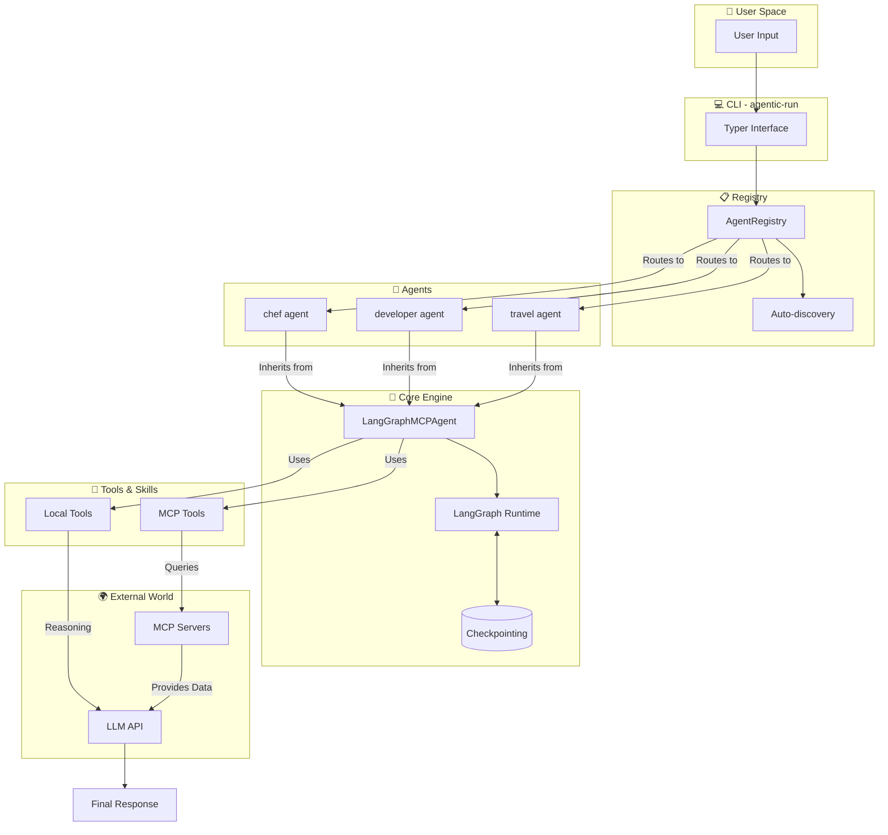

<div align="center">

# 🤖 Agentic Framework
**Build AI agents that *actually* do things.**

[](https://python.org)
[](https://python.langchain.com/)
[](https://modelcontextprotocol.io/)
[](https://www.docker.com/)
[](LICENSE)
[](https://github.com/jeancsil/agentic-framework/actions)
[](https://github.com/jeancsil/agentic-framework)
[](https://buymeacoffee.com/jeancsil)

<br>

Combine **local tools** and **MCP servers** in a single, elegant runtime.  
Write agents in **5 lines of code**. Run them anywhere.

</div>

---

## 💡 Why Agentic Framework?

Instead of spending days wiring together LLMs, tools, and execution environments, Agentic Framework gives you a production-ready setup instantly.

*   **Write Less, Do More:** Create a fully functional agent with just 5 lines of Python using the zero-config `@AgentRegistry.register` decorator.
*   **Context is King (MCP):** Native integration with Model Context Protocol (MCP) servers to give your agents live data (Web search, APIs, internal databases).
*   **Hardcore Local Tools:** Built-in blazing fast tools (`ripgrep`, `fd`, AST parsing) so your agents can explore and understand local codebases out-of-the-box.
*   **Stateful & Resilient:** Powered by **LangGraph** to support memory, cyclic reasoning, and human-in-the-loop workflows.
*   **Docker-First Isolation:** Every agent runs in isolated containers—no more "it works on my machine" when sharing with your team.

---

## 🎬 See it in Action

> *In this single command, the framework orchestrates 3 distinct AI sub-agents working together to plan a trip—built entirely in just **126 lines of Python**.*

<p align="center">
  
</p>

---

## 📑 Table of Contents
- [🧰 Available Out of the Box](#-available-out-of-the-box)
  - [🤖 Agents](#-agents)
  - [📦 Local Tools](#-local-tools)
  - [🌐 MCP Servers](#-mcp-servers)
  - [🧠 LLM Providers](#-llm-providers)
- [🚀 Quick Start (Zero to Agent in 60s)](#-quick-start-zero-to-agent-in-60s)
- [🛠️ Build Your Own Agent](#️-build-your-own-agent)
- [🏗️ Architecture](#️-architecture)
- [💻 CLI Reference](#-cli-reference)
- [🧑‍💻 Local Development](#local-development)
- [🎬 See it in Action](#-see-it-in-action)
- [🤝 Contributing](#-contributing)

---

## 🧰 Available Out of the Box

### 🤖 Agents

The framework includes several pre-built agents for common use cases:

| Agent | Purpose |
|-------|---------|
| `developer` | Code Master: Read, search & edit code |
| `travel-coordinator` | Trip Planner: Orchestrates agents |
| `chef` | Chef: Recipes from your fridge |
| `news` | News Anchor: Aggregates top stories |
| `travel` | Flight Booker: Finds the best routes |
| `simple` | Chat Buddy: Vanilla conversational agent |
| `github-pr-reviewer` | PR Reviewer: Reviews diffs, posts inline comments & summaries |
| `whatsapp` | WhatsApp Agent: Bidirectional WhatsApp communication |

📖 **See [docs/agents.md](docs/agents.md)** for detailed information about each agent, including configuration options and usage examples.

---

### 📦 Local Tools

Fast, zero-dependency tools for working with local codebases:

| Tool | Capability |
|------|------------|
| `find_files` | Fast search via `fd` |
| `discover_structure` | Directory tree mapping |
| `get_file_outline` | AST signature parsing |
| `read_file_fragment` | Precise file reading |
| `code_search` | Fast search via `ripgrep` |
| `edit_file` | Safe file editing |

📖 **See [docs/tools.md](docs/tools.md)** for detailed documentation of each tool, including parameters and examples.

---

### 🌐 MCP Servers

Model Context Protocol servers for extending agent capabilities:

| Server | Purpose |
|--------|---------|
| `kiwi-com-flight-search` | Search real-time flights |
| `webfetch` | Extract clean text from URLs & web search |
| `duckduckgo-search` | Web search via DuckDuckGo |

📖 **See [docs/mcp-servers.md](docs/mcp-servers.md)** for details on each server and how to add custom MCP servers.

---

### 🧠 LLM Providers

The framework supports **11 LLM providers** out of the box, covering 90%+ of the market:

| Provider | Type | Use Case |
|----------|------|----------|
| **Anthropic** | Cloud | State-of-the-art reasoning (Claude) |
| **OpenAI** | Cloud | GPT-4, GPT-4.1, o1 series |
| **Azure OpenAI** | Cloud | Enterprise OpenAI deployments |
| **Google GenAI** | Cloud | Gemini models via API |
| **Google Vertex AI** | Cloud | Gemini models via GCP |
| **Groq** | Cloud | Ultra-fast inference |
| **Mistral AI** | Cloud | European privacy-focused models |
| **Cohere** | Cloud | Enterprise RAG and Command models |
| **AWS Bedrock** | Cloud | Anthropic, Titan, Meta via AWS |
| **Ollama** | Local | Run LLMs locally (zero API cost) |
| **Hugging Face** | Cloud | Open models from Hugging Face Hub |

📖 **See [docs/llm-providers.md](docs/llm-providers.md)** for detailed setup instructions, environment variables, and provider comparison.

---

## 🚀 Quick Start (Zero to Agent in 60s)

### 1. Add your Brain (API Key)
You need an **LLM API key** to breathe life into your agents. The framework supports 10+ LLM providers via LangChain!

```bash
# Copy the template
cp .env.example .env

# Edit .env and paste your API key
# Choose one of the following providers:
# OPENAI_API_KEY=sk-your-key-here
# ANTHROPIC_API_KEY=sk-ant-your-key-here
# GOOGLE_API_KEY=your-google-key
# GROQ_API_KEY=gsk-your-key-here
# MISTRAL_API_KEY=your-mistral-key-here
# COHERE_API_KEY=your-cohere-key-here

# For Ollama (local), no API key needed:
# OLLAMA_BASE_URL=http://localhost:11434

# For Azure OpenAI:
# AZURE_OPENAI_API_KEY=your-azure-key
# AZURE_OPENAI_ENDPOINT=https://your-resource.openai.azure.com

# For Google Vertex AI:
# GOOGLE_VERTEX_PROJECT_ID=your-project-id

# For AWS Bedrock:
# AWS_PROFILE=your-profile

# For Hugging Face:
# HUGGINGFACEHUB_API_TOKEN=your-hf-token
```
> ⚠️ **Note:** Set your preferred provider's API key. Priority: Anthropic > Google Vertex > Google GenAI > Azure > Groq > Mistral > Cohere > Bedrock > HuggingFace > Ollama > OpenAI (default fallback).

### 2. Build & Run
No `pip`, no `virtualenv`, no *"it works on my machine"* excuses.

```bash
# Clone the repository
git clone https://github.com/jeancsil/agentic-framework.git
cd agentic-framework

# Build the Docker image
make docker-build

# Unleash your first agent!
bin/agent.sh developer -i "Explain this codebase"

# Or try the chef agent
bin/agent.sh chef -i "I have chicken, rice, and soy sauce. What can I make?"
```

<details>
<summary><strong>🔑 Required Environment Variables</strong></summary>

Only one provider's API key is required. The framework auto-detects which provider to use based on available credentials.

```bash
# Anthropic (Recommended)
ANTHROPIC_API_KEY=sk-ant-your-key-here

# OpenAI
OPENAI_API_KEY=sk-your-key-here

# Google GenAI / Vertex
GOOGLE_API_KEY=your-google-key
GOOGLE_VERTEX_PROJECT_ID=your-project-id

# Groq
GROQ_API_KEY=gsk-your-key-here

# Mistral AI
MISTRAL_API_KEY=your-mistral-key-here

# Cohere
COHERE_API_KEY=your-cohere-key-here

# Azure OpenAI
AZURE_OPENAI_API_KEY=your-azure-key
AZURE_OPENAI_ENDPOINT=https://your-resource.openai.azure.com

# AWS Bedrock
AWS_PROFILE=your-profile

# Ollama (Local, no API key needed)
OLLAMA_BASE_URL=http://localhost:11434

# Hugging Face
HUGGINGFACEHUB_API_TOKEN=your-hf-token
```

📖 **See [docs/llm-providers.md](docs/llm-providers.md)** for detailed environment variable configurations, model overrides, and provider comparison.

</details>

---

## 🛠️ Build Your Own Agent

### The 5-Line Superhero 🦸‍♂️

```python
from agentic_framework.core.langgraph_agent import LangGraphMCPAgent
from agentic_framework.registry import AgentRegistry

@AgentRegistry.register("my-agent", mcp_servers=["webfetch"])
class MyAgent(LangGraphMCPAgent):
    @property
    def system_prompt(self) -> str:
        return "You are my custom agent with the power to fetch websites."
```

Boom. Run it instantly:
```bash
bin/agent.sh my-agent -i "Summarize https://example.com"
```

### Advanced: Custom Local Tools 🔧

Want to add your own Python logic? Easy.

```python
from langchain_core.tools import StructuredTool
from agentic_framework.core.langgraph_agent import LangGraphMCPAgent
from agentic_framework.registry import AgentRegistry

@AgentRegistry.register("data-processor")
class DataProcessorAgent(LangGraphMCPAgent):
    @property
    def system_prompt(self) -> str:
        return "You process data files like a boss."

    def local_tools(self) -> list:
        return [
            StructuredTool.from_function(
                func=self.process_csv,
                name="process_csv",
                description="Process a CSV file path",
            )
        ]

    def process_csv(self, filepath: str) -> str:
        # Magic happens here ✨
        return f"Successfully processed {filepath}!"
```

---

## 🏗️ Architecture

Under the hood, we seamlessly bridge the gap between user intent and execution:



---

## 💻 CLI Reference

Command your agents directly from the terminal.

```bash
# 📋 List all registered agents
bin/agent.sh list

# 🕵️ Get detailed info about what an agent can do
bin/agent.sh info developer

# 🚀 Run an agent with input
bin/agent.sh developer -i "Analyze the architecture of this project"

# ⏱️ Run with an execution timeout (seconds)
bin/agent.sh developer -i "Refactor this module" -t 120

# 📝 Run with debug-level verbosity
bin/agent.sh developer -i "Hello" -v

# 📜 Access logs (same location as local)
tail -f agentic-framework/logs/agent.log

# 📱 Run the WhatsApp agent (requires config - see docs/agents.md)
agentic-run whatsapp --config config/whatsapp.yaml

# 📱 Run WhatsApp with custom settings
agentic-run whatsapp --allowed-contact "+1234567890" --storage ~/custom/path
```

---

<a id="local-development"></a>
## 🧑‍💻 Local Development

Prefer running without Docker? We got you.

<details>
<summary><strong>System Requirements & Setup</strong></summary>

**Requirements:**
- Python 3.13+
- `ripgrep`, `fd`, `fzf`

```bash
# Install dependencies (blazingly fast with uv ⚡)
make install

# Run the test suite
make test

# Run agents directly in your environment
uv --directory agentic-framework run agentic-run developer -i "Hello"
```
</details>

<details>
<summary><strong>Useful `make` Commands</strong></summary>

```bash
make install    # Install dependencies with uv
make test       # Run pytest with coverage
make format     # Auto-format codebase with ruff
make check      # Strict linting (mypy + ruff)
```
</details>

---

## 🤝 Contributing

We love contributions! Check out our [AGENTS.md](AGENTS.md) for development guidelines.

**The Golden Rules:**
1. `make check` should pass without complaints.
2. `make test` should stay green.
3. Don't drop test coverage (we like our 80% mark!).

---

## 📄 License

This project is licensed under the **MIT License**. See [LICENSE](LICENSE) for details.

---

<p align="center">
  <strong>Stand on the shoulders of giants:</strong><br>
  <a href="https://python.langchain.com/"></a>
  <a href="https://modelcontextprotocol.io/"></a>
  <a href="https://github.com/langchain-ai/langgraph"></a>
</p>

<p align="center">
  If you find this useful, please consider giving it a ⭐ or buying me a coffee!<br>
  <a href="https://github.com/jeancsil/agentic-framework/stargazers">
    
  </a>
  &nbsp;
  <a href="https://buymeacoffee.com/jeancsil" target="_blank">
    
  </a>
</p>
