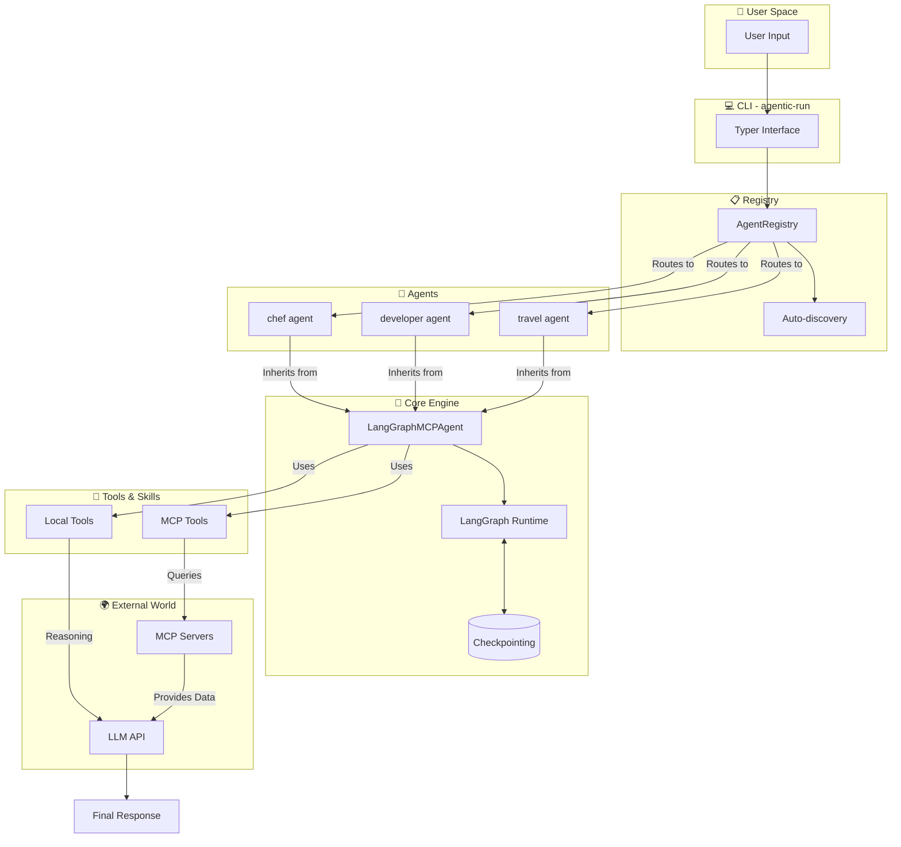

<div align="center">

# 🤖 Agentic Framework
**Build AI agents that *actually* do things.**

[](https://python.org)
[](https://python.langchain.com/)
[](https://modelcontextprotocol.io/)
[](https://www.docker.com/)
[](LICENSE)
[](https://github.com/jeancsil/agentic-framework/actions)
[](https://github.com/jeancsil/agentic-framework)
[](https://buymeacoffee.com/jeancsil)

<br>

Combine **local tools** and **MCP servers** in a single, elegant runtime.  
Write agents in **5 lines of code**. Run them anywhere.

</div>

---

## 💡 Why Agentic Framework?

Instead of spending days wiring together LLMs, tools, and execution environments, Agentic Framework gives you a production-ready setup instantly.

*   **Write Less, Do More:** Create a fully functional agent with just 5 lines of Python using the zero-config `@AgentRegistry.register` decorator.
*   **Context is King (MCP):** Native integration with Model Context Protocol (MCP) servers to give your agents live data (Web search, APIs, internal databases).
*   **Hardcore Local Tools:** Built-in blazing fast tools (`ripgrep`, `fd`, AST parsing) so your agents can explore and understand local codebases out-of-the-box.
*   **Stateful & Resilient:** Powered by **LangGraph** to support memory, cyclic reasoning, and human-in-the-loop workflows.
*   **Docker-First Isolation:** Every agent runs in isolated containers—no more "it works on my machine" when sharing with your team.

---

## 🎬 See it in Action

> *In this single command, the framework orchestrates 3 distinct AI sub-agents working together to plan a trip—built entirely in just **126 lines of Python**.*

<p align="center">
  
</p>

---

## 📑 Table of Contents
- [🧰 Available Out of the Box](#-available-out-of-the-box)
  - [🤖 Agents](#-agents)
  - [📦 Local Tools (Zero External Dependencies)](#-local-tools-zero-external-dependencies)
  - [🌐 MCP Servers (Context Superpowers)](#-mcp-servers-context-superpowers)
- [🚀 Quick Start (Zero to Agent in 60s)](#-quick-start-zero-to-agent-in-60s)
- [🛠️ Build Your Own Agent](#️-build-your-own-agent)
- [🏗️ Architecture](#️-architecture)
- [💻 CLI Reference](#-cli-reference)
- [🧑‍💻 Local Development](#local-development)
- [🎬 See it in Action](#-see-it-in-action)
- [🤝 Contributing](#-contributing)

---

## 🧰 Available Out of the Box

### 🤖 Agents

<table>
  <thead>
    <tr>
      <th width="25%">Agent</th>
      <th width="40%">Purpose</th>
      <th width="15%">MCP Servers</th>
      <th width="20%">Local Tools</th>
    </tr>
  </thead>
  <tbody>
    <tr>
      <td><code>developer</code></td>
      <td><b>Code Master:</b> Read, search &amp; edit code.</td>
      <td><code>webfetch</code></td>
      <td><i>All codebase tools below</i></td>
    </tr>
    <tr>
      <td><code>travel-coordinator</code></td>
      <td><b>Trip Planner:</b> Orchestrates agents.</td>
      <td><code>kiwi-com-flight-search</code><br><code>webfetch</code></td>
      <td><i>Uses 3 sub-agents</i></td>
    </tr>
    <tr>
      <td><code>chef</code></td>
      <td><b>Chef:</b> Recipes from your fridge.</td>
      <td><code>webfetch</code></td>
      <td>-</td>
    </tr>
    <tr>
      <td><code>news</code></td>
      <td><b>News Anchor:</b> Aggregates top stories.</td>
      <td><code>webfetch</code></td>
      <td>-</td>
    </tr>
    <tr>
      <td><code>travel</code></td>
      <td><b>Flight Booker:</b> Finds the best routes.</td>
      <td><code>kiwi-com-flight-search</code></td>
      <td>-</td>
    </tr>
    <tr>
      <td><code>simple</code></td>
      <td><b>Chat Buddy:</b> Vanilla conversational agent.</td>
      <td>-</td>
      <td>-</td>
    </tr>
    <tr>
      <td><code>github-pr-reviewer</code></td>
      <td><b>PR Reviewer:</b> Reviews diffs, posts inline comments &amp; summaries.</td>
      <td>-</td>
      <td>
        <details>
          <summary>View tools</summary>
          <code>get_pr_diff</code><br>
          <code>get_pr_comments</code><br>
          <code>post_review_comment</code><br>
          <code>post_general_comment</code><br>
          <code>reply_to_review_comment</code><br>
          <code>get_pr_metadata</code>
        </details>
      </td>
    </tr>
    <tr>
      <td><code>whatsapp</code></td>
      <td><b>WhatsApp Agent:</b> Bidirectional WhatsApp communication (personal account).</td>
      <td><code>webfetch</code><br><code>duckduckgo-search</code></td>
      <td>-</td>
    </tr>
  </tbody>
</table>

<details>
<summary><strong>📱 WhatsApp Agent Setup</strong></summary>

The WhatsApp agent enables bidirectional communication through your personal WhatsApp account using QR code authentication.

**Requirements:**
- Go 1.21+ and Git (for WhatsApp backend)
- Python 3.13+
- A configured LLM provider (see environment variables below)

**Configuration:**
```bash
# 1. Copy example config
cp agentic-framework/config/whatsapp.yaml.example agentic-framework/config/whatsapp.yaml

# 2. Edit config/whatsapp.yaml with your settings:
# - model: "claude-sonnet-4-6"  # Your LLM model
# - privacy.allowed_contact: "+34 666 666 666"  # Your phone number (only this number can interact)
# - channel.storage_path: "~/storage/whatsapp"  # Where to store session data
# - mcp_servers: ["web-fetch", "duckduckgo-search"]  # Optional: MCP servers to use
```

**Usage:**
```bash
# Start the WhatsApp agent
bin/agent.sh whatsapp --config config/whatsapp.yaml

# With custom settings (overrides config file)
bin/agent.sh whatsapp --allowed-contact "+1234567890" --storage ~/custom/path

# Customize MCP servers
bin/agent.sh whatsapp --mcp-servers "web-fetch,duckduckgo-search"
bin/agent.sh whatsapp --mcp-servers none  # Disable MCP

# Verbose mode for debugging
bin/agent.sh whatsapp --verbose
```

**First Run:**
1. Scan the QR code displayed in your terminal
2. Wait for WhatsApp to authenticate
3. Send a message from your configured phone number
4. Agent will respond automatically

**Privacy & Security:**
- 🔒 Only processes messages from the configured contact
- 🔒 Group chat messages are automatically filtered (not sent to LLM)
- 🔒 All data stored locally (no cloud storage of conversations)
- 🔒 Messages from other contacts are silently ignored
- 🔒 Message deduplication prevents reprocessing

**Configuration Options:**
- `model`: LLM model to use (defaults to provider default)
- `mcp_servers`: MCP servers for web search and content fetching
- `privacy.allowed_contact`: Only this phone number can interact with the agent
- `privacy.log_filtered_messages`: Log filtered messages for debugging
- `channel.storage_path`: Directory for WhatsApp session and database files
- `features.group_messages`: Currently disabled by default for privacy

</details>

### 📦 Local Tools (Zero External Dependencies)

<table>
  <thead>
    <tr>
      <th width="15%">Tool</th>
      <th width="55%">Capability</th>
      <th width="30%">Example</th>
    </tr>
  </thead>
  <tbody>
    <tr>
      <td><code>find_files</code></td>
      <td>Fast search via <code>fd</code></td>
      <td><code>*.py</code> finds Python files</td>
    </tr>
    <tr>
      <td><code>discover_structure</code></td>
      <td>Directory tree mapping</td>
      <td>Understands project layout</td>
    </tr>
    <tr>
      <td><code>get_file_outline</code></td>
      <td>AST signature parsing (Python, TS, Go, Rust, Java, C++, PHP)</td>
      <td>Extracts classes/functions</td>
    </tr>
    <tr>
      <td><code>read_file_fragment</code></td>
      <td>Precise file reading</td>
      <td><code>file.py:10:50</code></td>
    </tr>
    <tr>
      <td><code>code_search</code></td>
      <td>Fast search via <code>ripgrep</code></td>
      <td>Global regex search</td>
    </tr>
    <tr>
      <td><code>edit_file</code></td>
      <td>Safe file editing</td>
      <td>Inserts/Replaces lines</td>
    </tr>
  </tbody>
</table>

<details>
<summary><strong>📝 Advanced: <code>edit_file</code> Formats</strong></summary>

**RECOMMENDED: `search_replace` (no line numbers needed)**
```json
{"op": "search_replace", "path": "file.py", "old": "exact text", "new": "replacement text"}
```

**Line-based operations:**
`replace:path:start:end:content` | `insert:path:after_line:content` | `delete:path:start:end`

</details>

### 🌐 MCP Servers (Context Superpowers)

<table>
  <thead>
    <tr>
      <th width="35%">Server</th>
      <th width="45%">Purpose</th>
      <th width="20%">API Key Needed?</th>
    </tr>
  </thead>
  <tbody>
    <tr>
      <td><code>kiwi-com-flight-search</code></td>
      <td>Search real-time flights</td>
      <td>🟢 No</td>
    </tr>
    <tr>
      <td><code>webfetch</code></td>
      <td>Extract clean text from URLs &amp; web search</td>
      <td>🟢 No</td>
    </tr>
  </tbody>
</table>

---

### 🧠 Supported LLM Providers

The framework supports **10+ LLM providers** out of the box, covering 90%+ of the LLM market:

<table>
  <thead>
    <tr>
      <th width="25%">Provider</th>
      <th width="20%">Type</th>
      <th width="55%">Use Case</th>
    </tr>
  </thead>
  <tbody>
    <tr>
      <td><b>Anthropic</b></td>
      <td>Cloud</td>
      <td>State-of-the-art reasoning (Claude)</td>
    </tr>
    <tr>
      <td><b>OpenAI</b></td>
      <td>Cloud</td>
      <td>GPT-4, GPT-4.1, o1 series</td>
    </tr>
    <tr>
      <td><b>Azure OpenAI</b></td>
      <td>Cloud</td>
      <td>Enterprise OpenAI deployments</td>
    </tr>
    <tr>
      <td><b>Google GenAI</b></td>
      <td>Cloud</td>
      <td>Gemini models via API</td>
    </tr>
    <tr>
      <td><b>Google Vertex AI</b></td>
      <td>Cloud</td>
      <td>Gemini models via GCP</td>
    </tr>
    <tr>
      <td><b>Groq</b></td>
      <td>Cloud</td>
      <td>Ultra-fast inference</td>
    </tr>
    <tr>
      <td><b>Mistral AI</b></td>
      <td>Cloud</td>
      <td>European privacy-focused models</td>
    </tr>
    <tr>
      <td><b>Cohere</b></td>
      <td>Cloud</td>
      <td>Enterprise RAG and Command models</td>
    </tr>
    <tr>
      <td><b>AWS Bedrock</b></td>
      <td>Cloud</td>
      <td>Anthropic, Titan, Meta via AWS</td>
    </tr>
    <tr>
      <td><b>Ollama</b></td>
      <td>Local</td>
      <td>Run LLMs locally (zero API cost)</td>
    </tr>
    <tr>
      <td><b>Hugging Face</b></td>
      <td>Cloud</td>
      <td>Open models from Hugging Face Hub</td>
    </tr>
  </tbody>
</table>

**Provider Priority:** Anthropic > Google Vertex > Google GenAI > Azure > Groq > Mistral > Cohere > Bedrock > HuggingFace > Ollama > OpenAI (fallback)

---

## 🚀 Quick Start (Zero to Agent in 60s)

### 1. Add your Brain (API Key)
You need an **LLM API key** to breathe life into your agents. The framework supports 10+ LLM providers via LangChain!

```bash
# Copy the template
cp .env.example .env

# Edit .env and paste your API key
# Choose one of the following providers:
# OPENAI_API_KEY=sk-your-key-here
# ANTHROPIC_API_KEY=sk-ant-your-key-here
# GOOGLE_API_KEY=your-google-key
# GROQ_API_KEY=gsk-your-key-here
# MISTRAL_API_KEY=your-mistral-key-here
# COHERE_API_KEY=your-cohere-key-here

# For Ollama (local), no API key needed:
# OLLAMA_BASE_URL=http://localhost:11434

# For Azure OpenAI:
# AZURE_OPENAI_API_KEY=your-azure-key
# AZURE_OPENAI_ENDPOINT=https://your-resource.openai.azure.com

# For Google Vertex AI:
# GOOGLE_VERTEX_PROJECT_ID=your-project-id

# For AWS Bedrock:
# AWS_PROFILE=your-profile

# For Hugging Face:
# HUGGINGFACEHUB_API_TOKEN=your-hf-token
```
> ⚠️ **Note:** Set your preferred provider's API key. Priority: Anthropic > Google Vertex > Google GenAI > Azure > Groq > Mistral > Cohere > Bedrock > HuggingFace > Ollama > OpenAI (default fallback).

### 2. Build & Run
No `pip`, no `virtualenv`, no *"it works on my machine"* excuses.

```bash
# Clone the repository
git clone https://github.com/jeancsil/agentic-framework.git
cd agentic-framework

# Build the Docker image
make docker-build

# Unleash your first agent!
bin/agent.sh developer -i "Explain this codebase"

# Or try the chef agent
bin/agent.sh chef -i "I have chicken, rice, and soy sauce. What can I make?"
```

<details>
<summary><strong>🔑 Required Environment Variables</strong></summary>

<table>
  <thead>
    <tr>
      <th width="20%">Provider</th>
      <th width="35%">Variable</th>
      <th width="15%">Required?</th>
      <th width="30%">Default Model</th>
    </tr>
  </thead>
  <tbody>
    <tr>
      <td><b>Anthropic</b></td>
      <td><code>ANTHROPIC_API_KEY</code></td>
      <td>🟢 <b>Yes*</b></td>
      <td><code>claude-haiku-4-5-20251001</code></td>
    </tr>
    <tr>
      <td><b>OpenAI</b></td>
      <td><code>OPENAI_API_KEY</code></td>
      <td>🟢 <b>Yes*</b></td>
      <td><code>gpt-4o-mini</code></td>
    </tr>
    <tr>
      <td><b>Azure OpenAI</b></td>
      <td><code>AZURE_OPENAI_API_KEY</code>, <code>AZURE_OPENAI_ENDPOINT</code></td>
      <td>⚪ No</td>
      <td><code>gpt-4o-mini</code></td>
    </tr>
    <tr>
      <td><b>Google GenAI</b></td>
      <td><code>GOOGLE_API_KEY</code></td>
      <td>⚪ No</td>
      <td><code>gemini-2.0-flash-exp</code></td>
    </tr>
    <tr>
      <td><b>Google Vertex AI</b></td>
      <td><code>GOOGLE_VERTEX_PROJECT_ID</code></td>
      <td>⚪ No</td>
      <td><code>gemini-2.0-flash-exp</code></td>
    </tr>
    <tr>
      <td><b>Groq</b></td>
      <td><code>GROQ_API_KEY</code></td>
      <td>⚪ No</td>
      <td><code>llama-3.3-70b-versatile</code></td>
    </tr>
    <tr>
      <td><b>Mistral AI</b></td>
      <td><code>MISTRAL_API_KEY</code></td>
      <td>⚪ No</td>
      <td><code>mistral-large-latest</code></td>
    </tr>
    <tr>
      <td><b>Cohere</b></td>
      <td><code>COHERE_API_KEY</code></td>
      <td>⚪ No</td>
      <td><code>command-r-plus</code></td>
    </tr>
    <tr>
      <td><b>AWS Bedrock</b></td>
      <td><code>AWS_PROFILE</code> or <code>AWS_ACCESS_KEY_ID</code></td>
      <td>⚪ No</td>
      <td><code>anthropic.claude-3-5-sonnet-20241022-v2:0</code></td>
    </tr>
    <tr>
      <td><b>Ollama</b></td>
      <td><code>OLLAMA_BASE_URL</code></td>
      <td>⚪ No</td>
      <td><code>llama3.2</code></td>
    </tr>
    <tr>
      <td><b>Hugging Face</b></td>
      <td><code>HUGGINGFACEHUB_API_TOKEN</code></td>
      <td>⚪ No</td>
      <td><code>meta-llama/Llama-3.2-3B-Instruct</code></td>
    </tr>
  </tbody>
</table>

**Model Override Variables** (optional):
- `ANTHROPIC_MODEL_NAME`, `OPENAI_MODEL_NAME`, `AZURE_OPENAI_MODEL_NAME`, `GOOGLE_GENAI_MODEL_NAME`, `GROQ_MODEL_NAME`, etc.

> ⚠️ **Note:** Only one provider's API key is required. The framework auto-detects which provider to use based on available credentials.

</details>

---

## 🛠️ Build Your Own Agent

### The 5-Line Superhero 🦸‍♂️

```python
from agentic_framework.core.langgraph_agent import LangGraphMCPAgent
from agentic_framework.registry import AgentRegistry

@AgentRegistry.register("my-agent", mcp_servers=["webfetch"])
class MyAgent(LangGraphMCPAgent):
    @property
    def system_prompt(self) -> str:
        return "You are my custom agent with the power to fetch websites."
```

Boom. Run it instantly:
```bash
bin/agent.sh my-agent -i "Summarize https://example.com"
```

### Advanced: Custom Local Tools 🔧

Want to add your own Python logic? Easy.

```python
from langchain_core.tools import StructuredTool
from agentic_framework.core.langgraph_agent import LangGraphMCPAgent
from agentic_framework.registry import AgentRegistry

@AgentRegistry.register("data-processor")
class DataProcessorAgent(LangGraphMCPAgent):
    @property
    def system_prompt(self) -> str:
        return "You process data files like a boss."

    def local_tools(self) -> list:
        return [
            StructuredTool.from_function(
                func=self.process_csv,
                name="process_csv",
                description="Process a CSV file path",
            )
        ]

    def process_csv(self, filepath: str) -> str:
        # Magic happens here ✨
        return f"Successfully processed {filepath}!"
```

---

## 🏗️ Architecture

Under the hood, we seamlessly bridge the gap between user intent and execution:



---

## 💻 CLI Reference

Command your agents directly from the terminal.

```bash
# 📋 List all registered agents
bin/agent.sh list

# 🕵️ Get detailed info about what an agent can do
bin/agent.sh info developer

# 🚀 Run an agent with input
bin/agent.sh developer -i "Analyze the architecture of this project"

# ⏱️ Run with an execution timeout (seconds)
bin/agent.sh developer -i "Refactor this module" -t 120

# 📝 Run with debug-level verbosity
bin/agent.sh developer -i "Hello" -v

# 📜 Access logs (same location as local)
tail -f agentic-framework/logs/agent.log

# 📱 Run the WhatsApp agent (requires config)
agentic-run whatsapp --config config/whatsapp.yaml

# 📱 Run WhatsApp with custom settings
agentic-run whatsapp --allowed-contact "+1234567890" --storage ~/custom/path
```

---

<a id="local-development"></a>
## 🧑‍💻 Local Development

Prefer running without Docker? We got you.

<details>
<summary><strong>System Requirements & Setup</strong></summary>

**Requirements:**
- Python 3.13+
- `ripgrep`, `fd`, `fzf`

```bash
# Install dependencies (blazingly fast with uv ⚡)
make install

# Run the test suite
make test

# Run agents directly in your environment
uv --directory agentic-framework run agentic-run developer -i "Hello"
```
</details>

<details>
<summary><strong>Useful `make` Commands</strong></summary>

```bash
make install    # Install dependencies with uv
make test       # Run pytest with coverage
make format     # Auto-format codebase with ruff
make check      # Strict linting (mypy + ruff)
```
</details>

---

## 🤝 Contributing

We love contributions! Check out our [AGENTS.md](AGENTS.md) for development guidelines.

**The Golden Rules:**
1. `make check` should pass without complaints.
2. `make test` should stay green.
3. Don't drop test coverage (we like our 80% mark!).

---

## 📄 License

This project is licensed under the **MIT License**. See [LICENSE](LICENSE) for details.

---

<p align="center">
  <strong>Stand on the shoulders of giants:</strong><br>
  <a href="https://python.langchain.com/"></a>
  <a href="https://modelcontextprotocol.io/"></a>
  <a href="https://github.com/langchain-ai/langgraph"></a>
</p>

<p align="center">
  If you find this useful, please consider giving it a ⭐ or buying me a coffee!<br>
  <a href="https://github.com/jeancsil/agentic-framework/stargazers">
    
  </a>
  &nbsp;
  <a href="https://buymeacoffee.com/jeancsil" target="_blank">
    
  </a>
</p>
