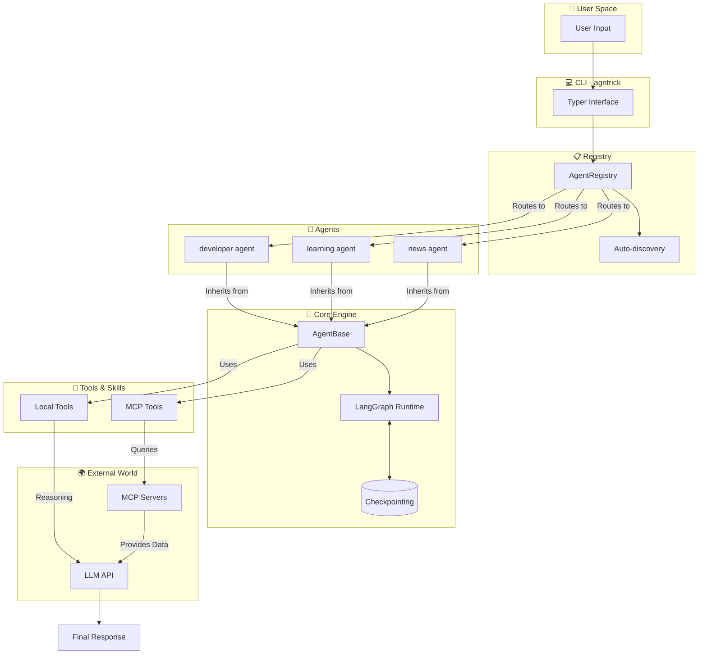

<div align="center">

# 🎩 Agntrick
**Build AI agents that *actually* do things.**

[](https://pypi.org/project/agntrick/)
[](https://python.org)
[](https://python.langchain.com/)
[](https://modelcontextprotocol.io/)
[](LICENSE)
[](https://github.com/jeancsil/agntrick/actions)
[](https://github.com/jeancsil/agntrick)

<br>

Combine **local tools** and **MCP servers** in a single, elegant runtime.
Write agents in **5 lines of code**. Run them anywhere.

</div>

---

## 💡 Why Agntrick?

Instead of spending days wiring together LLMs, tools, and execution environments, Agntrick gives you a production-ready setup instantly.

*   **Write Less, Do More:** Create a fully functional agent with just 5 lines of Python using the zero-config `@AgentRegistry.register` decorator.
*   **Context is King (MCP):** Native integration with Model Context Protocol (MCP) servers to give your agents live data (Web search, APIs, internal databases).
*   **Hardcore Local Tools:** Built-in blazing fast tools (`ripgrep`, `fd`, AST parsing) so your agents can explore and understand local codebases out-of-the-box.
*   **Stateful & Resilient:** Powered by **LangGraph** to support memory, cyclic reasoning, and human-in-the-loop workflows.
*   **Docker-First Isolation:** Every agent runs in isolated containers—no more "it works on my machine" when sharing with your team.

---

## 📦 Installation

### From PyPI

```bash
pip install agntrick

# Or with development dependencies
pip install "agntrick[dev]"
```

### From Source

```bash
git clone https://github.com/jeancsil/agntrick.git
cd agntrick
make install
```

---

## 🚀 Quick Start

### 1. Add your Brain (API Key)

You need an **LLM API key** to breathe life into your agents. Agntrick supports 10+ LLM providers via LangChain!

```bash
# Copy the template
cp .env.example .env

# Edit .env and paste your API key
# Choose one of the following providers:
# OPENAI_API_KEY=sk-your-key-here
# ANTHROPIC_API_KEY=sk-ant-your-key-here
# GOOGLE_API_KEY=your-google-key
# GROQ_API_KEY=gsk-your-key-here
# MISTRAL_API_KEY=your-mistral-key-here
# COHERE_API_KEY=your-cohere-key-here

# For Ollama (local), no API key needed:
# OLLAMA_BASE_URL=http://localhost:11434
```

### 2. Run Your First Agent

```bash
# List all available agents
agntrick list

# Run an agent with input
agntrick developer -i "Explain this codebase"

# Or try the learning agent with web search
agntrick learning -i "Explain quantum computing in simple terms"
```

<details>
<summary><strong>🔑 Supported Environment Variables</strong></summary>

Only one provider's API key is required. The framework auto-detects which provider to use based on available credentials.

```bash
# Anthropic (Recommended)
ANTHROPIC_API_KEY=sk-ant-your-key-here

# OpenAI
OPENAI_API_KEY=sk-your-key-here

# Google GenAI / Vertex
GOOGLE_API_KEY=your-google-key
GOOGLE_VERTEX_PROJECT_ID=your-project-id

# Mistral AI
MISTRAL_API_KEY=your-mistral-key-here

# Cohere
COHERE_API_KEY=your-cohere-key-here

# Azure OpenAI
AZURE_OPENAI_API_KEY=your-azure-key
AZURE_OPENAI_ENDPOINT=https://your-resource.openai.azure.com

# AWS Bedrock
AWS_PROFILE=your-profile

# Ollama (Local, no API key needed)
OLLAMA_BASE_URL=http://localhost:11434

# Hugging Face
HUGGINGFACEHUB_API_TOKEN=your-hf-token
```

📖 **See [docs/llm-providers.md](docs/llm-providers.md)** for detailed environment variable configurations and provider comparison.

</details>

---

## 🧰 Available Out of the Box

### 🤖 Bundled Agents

Agntrick includes several pre-built agents for common use cases:

| Agent | Purpose | MCP Servers |
|-------|---------|-------------|
| `developer` | Code Master: Read, search & edit code | `fetch` |
| `github-pr-reviewer` | PR Reviewer: Reviews diffs, posts inline comments & summaries | - |
| `learning` | Tutor: Step-by-step tutorials and explanations | `fetch`, `web-forager` |
| `news` | News Anchor: Aggregates top stories | `fetch` |
| `youtube` | Video Analyst: Extract insights from YouTube videos | `fetch` |

📖 **See [docs/agents.md](docs/agents.md)** for detailed information about each agent.

---

### 📦 Local Tools

Fast, zero-dependency tools for working with local codebases:

| Tool | Capability |
|------|------------|
| `find_files` | Fast search via `fd` |
| `discover_structure` | Directory tree mapping |
| `get_file_outline` | AST signature parsing |
| `read_file_fragment` | Precise file reading |
| `code_search` | Fast search via `ripgrep` |
| `edit_file` | Safe file editing |
| `youtube_transcript` | Extract transcripts from YouTube videos |

📖 **See [docs/tools.md](docs/tools.md)** for detailed documentation of each tool.

---

### 🌐 MCP Servers

Model Context Protocol servers for extending agent capabilities:

| Server | Purpose |
|--------|---------|
| `fetch` | Extract clean text from URLs |
| `web-forager` | Web search and content fetching |
| `kiwi-com-flight-search` | Search real-time flights |

📖 **See [docs/mcp-servers.md](docs/mcp-servers.md)** for details on each server and how to add custom MCP servers.

---

### 🧠 LLM Providers

Agntrick supports **10 LLM providers** out of the box, covering 90%+ of the market:

| Provider | Type | Use Case |
|----------|------|----------|
| **Anthropic** | Cloud | State-of-the-art reasoning (Claude) |
| **OpenAI** | Cloud | GPT-4, GPT-4.1, o1 series |
| **Azure OpenAI** | Cloud | Enterprise OpenAI deployments |
| **Google GenAI** | Cloud | Gemini models via API |
| **Google Vertex AI** | Cloud | Gemini models via GCP |
| **Mistral AI** | Cloud | European privacy-focused models |
| **Cohere** | Cloud | Enterprise RAG and Command models |
| **AWS Bedrock** | Cloud | Anthropic, Titan, Meta via AWS |
| **Ollama** | Local | Run LLMs locally (zero API cost) |
| **Hugging Face** | Cloud | Open models from Hugging Face Hub |

📖 **See [docs/llm-providers.md](docs/llm-providers.md)** for detailed setup instructions.

---

## 🛠️ Build Your Own Agent

### The 5-Line Superhero 🦸‍♂️

```python
from agntrick import AgentBase, AgentRegistry

@AgentRegistry.register("my-agent", mcp_servers=["fetch"])
class MyAgent(AgentBase):
    @property
    def system_prompt(self) -> str:
        return "You are my custom agent with the power to fetch websites."
```

Boom. Run it instantly:
```bash
agntrick my-agent -i "Summarize https://example.com"
```

### Advanced: Custom Local Tools 🔧

Want to add your own Python logic? Easy.

```python
from langchain_core.tools import StructuredTool
from agntrick import AgentBase, AgentRegistry

@AgentRegistry.register("data-processor")
class DataProcessorAgent(AgentBase):
    @property
    def system_prompt(self) -> str:
        return "You process data files like a boss."

    def local_tools(self) -> list:
        return [
            StructuredTool.from_function(
                func=self.process_csv,
                name="process_csv",
                description="Process a CSV file path",
            )
        ]

    def process_csv(self, filepath: str) -> str:
        # Magic happens here ✨
        return f"Successfully processed {filepath}!"
```

---

## ⚙️ Configuration

Agntrick can be configured via a `.agntrick.yaml` file in your project root or home directory:

```yaml
# .agntrick.yaml
llm:
  provider: anthropic  # or openai, google, ollama, etc.
  model: claude-sonnet-4-6  # optional model override
  temperature: 0.7

mcp:
  servers:
    - fetch
    - web-forager

logging:
  level: INFO
  file: logs/agent.log
```

---

## 💻 CLI Reference

Command your agents directly from the terminal.

```bash
# 📋 List all registered agents
agntrick list

# 🕵️ Get detailed info about what an agent can do
agntrick info developer

# 🚀 Run an agent with input
agntrick developer -i "Analyze the architecture of this project"

# ⏱️ Run with an execution timeout (seconds)
agntrick developer -i "Refactor this module" -t 120

# 📝 Run with debug-level verbosity
agntrick developer -i "Hello" -v

# 📜 View logs
tail -f logs/agent.log
```

---

## 🏗️ Architecture

Under the hood, we seamlessly bridge the gap between user intent and execution:



---

## 🧑‍💻 Local Development

<details>
<summary><strong>System Requirements & Setup</strong></summary>

**Requirements:**
- Python 3.12+
- `uv` package manager
- `ripgrep`, `fd`, `fzf` (for local tools)

```bash
# Install dependencies (blazingly fast with uv ⚡)
make install

# Run the test suite
make test

# Run agents directly
agntrick developer -i "Hello"
```
</details>

<details>
<summary><strong>Useful `make` Commands</strong></summary>

```bash
make install    # Install dependencies with uv
make test       # Run pytest with coverage
make format     # Auto-format codebase with ruff
make check      # Strict linting (mypy + ruff)
make build      # Build wheel and sdist packages
make build-clean # Remove build artifacts
```
</details>

---

## 🤝 Contributing

We love contributions! Check out our [AGENTS.md](AGENTS.md) for development guidelines.

**For maintainers:** See [RELEASING.md](RELEASING.md) for how to publish new versions to PyPI.

**The Golden Rules:**
1. `make check` should pass without complaints.
2. `make test` should stay green.
3. Don't drop test coverage (we like our 80% mark!).

---

## 📄 License

This project is licensed under the **MIT License**. See [LICENSE](LICENSE) for details.

---

<p align="center">
  <strong>Stand on the shoulders of giants:</strong><br>
  <a href="https://python.langchain.com/"></a>
  <a href="https://modelcontextprotocol.io/"></a>
  <a href="https://github.com/langchain-ai/langgraph"></a>
</p>

<p align="center">
  If you find this useful, please consider giving it a ⭐ or buying me a coffee!<br>
  <a href="https://github.com/jeancsil/agntrick/stargazers">
    
  </a>
  &nbsp;
  <a href="https://buymeacoffee.com/jeancsil" target="_blank">
    
  </a>
</p>
